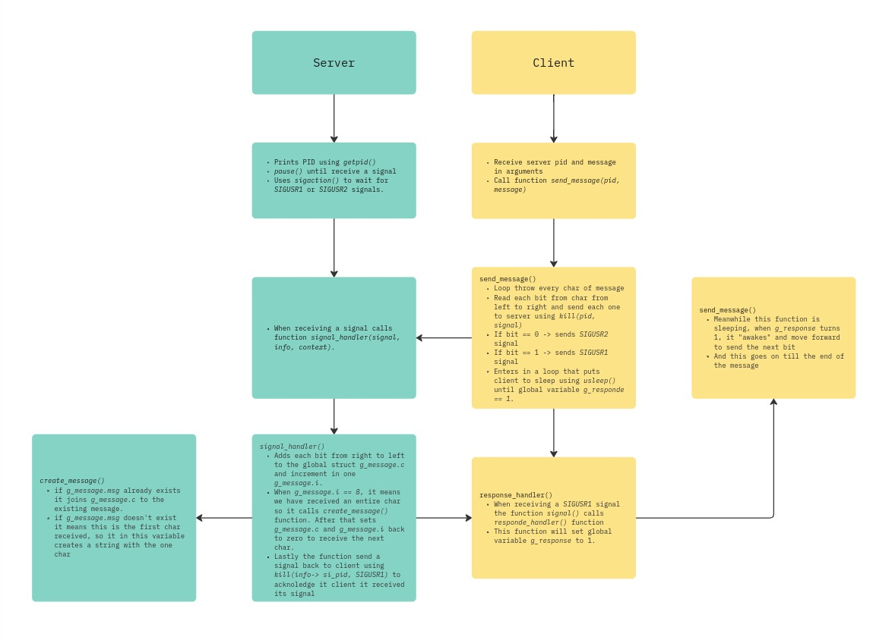

# Minitalk
Minitalk is a project at 42 School that introduces and prepares you for bigger UNIX projects that will appear later in the curriculum. The purpose of this project is to code a small data exchange program between a server and client using UNIX signals. To accomplish that, you will need to learn about UNIX signals and how to handle them effectively.

## Understanding the project
In this project, you are required to create two files: a server and a client.

- **Server**: When executed, the server will listen for incoming signals. Upon receiving a signal, it will decode the message and, once the entire message has been received, print it to the terminal.
- **Client**: The client will send an encrypted message to the server using signals. The message will be passed as an argument to the client.

The process of sending the message is done by converting each character to its binary form. For each bit:

- If the bit is 1, the client sends SIGUSR1.
- If the bit is 0, the client sends SIGUSR2.

This means that the communication between the server and the client occurs through binary encoding, and SIGUSR1 and SIGUSR2 are the only signals allowed for this exchange.

## But what are UNIX signals?
UNIX signals are a form of inter-process communication (IPC) used to notify processes that an event has occurred. Signals can be sent by a process to another process (or to itself) to communicate information, often triggering specific actions.

Signals are asynchronous, which means they can interrupt the normal flow of a program. For example, the server process will be paused until a signal is received, at which point it processes the signal and continues. This project uses signals for both communication and synchronization between the client and server.

### Why Use Signals?
It allows more efficient and lightweight communication between the server and the client. Instead of relying on more complex methods like sockets or files, signals provide a simple mechanism to convey information. This is particularly suitable for small projects and exercises to understand low-level process management in UNIX systems.

## `signal` library
To manage UNIX signals, the project utilizes the signal library. Here’s a breakdown of the key components used:

- `sigaction`: The `sigaction` structure is used to define the behavior of a process when it receives a signal. It allows you to specify which function should be called to handle the signal, whether additional signal information should be available, and which signals should be blocked while handling the signal.

-`sigemptyset()`: This function is used to initialize a signal set to be empty (i.e., no signals are blocked). It’s useful when configuring a signal handler with no restrictions on other signals while the handler is running.

- `signal()` and `sigaction()`: These are functions used to set up signal handlers in a program. These signal handlers define how a program should behave when it receives a specific signal.

## Other new functions

- `getpid`: Retrieves the process ID (PID) of the current process. We will use to print server PID.
- `usleep`: Suspends the program execution for a specified number of microseconds. This is useful for introducing a delay to avoid overwhelming the server with rapid signal sending.
- `sleep`: Suspends the program execution for a specified number of seconds.
- `kill`: Sends a signal to a process or group of processes. This is the core function used by the client to transmit signals (SIGUSR1 or SIGUSR2) to the server.
- `exit`: Terminates the program. It is used to exit gracefully when an error occurs or when the task is complete.
- `pause`: Causes the process to stop and wait until a signal is received. The server uses this function to wait for incoming signals from the client.

## Utilities Functions
Besides some of my Libft functions (which I added in the `lib` folder), I also created several utility functions specifically for this project.

#### 1) `send_message()`
On the client side, sends a message from the client to the server by encoding it bit by bit:

- Loops through each character of the message.
- For each character, iterate over its 8 bits (starting from the most significant bit).
- Sends **SIGUSR1** for a 1 bit and **SIGUSR2** for a 0 bit using the `kill` function.
- After sending each bit, wait for the server's acknowledgment to proceed.

#### 2) `signal_handler()`
On the server side, processes signals from the client to reconstruct the message:

- **Bit Decoding:** Each signal represents a bit (`SIGUSR1 = 1`, `SIGUSR2 = 0`), which is added to the current character (`g_message.c`).
- **Character Assembly:** After 8 bits, a full character is formed:
    - If the character is `'\0'`, the server prints the full message and resets.
    - Otherwise, the character is added to the message.
- **Acknowledgment:** Sends **SIGUSR1** back to the client after each signal is processed.

#### 3) `create_message()`
Dynamically builds the message:

- Appends the current character (`g_message.c`) to the growing message (`g_message.msg`).
- Initialize the message if it's the first character.
- Ensures proper memory management and exits on allocation failure.

#### 4) `response_handler()`
On the client side, update the global variable `g_response` to confirm that the server received and processed the bit sent.

## Workflow Diagram

The following diagram illustrates how this minitalk works:

